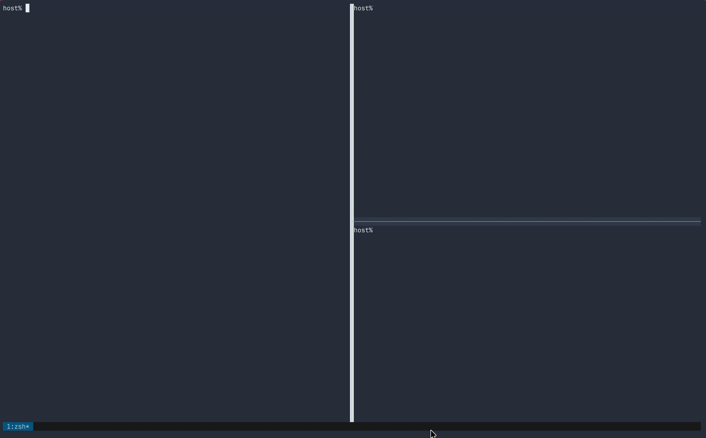

# plotty

[](https://github.com/xuesoso/plotty/actions/workflows/ci.yml)
[](https://github.com/xuesoso/plotty/actions/workflows/ci.yml)
[](pyproject.toml)
[](LICENSE)

> Inline matplotlib plots in your terminal — rendered as **sixel** in a dedicated
> tmux pane, **including over SSH**. No browser, no X11, no Jupyter server —
> and **zero dependencies** beyond matplotlib (the sixel encoder is built in).

<p align="center">
  
</p>

`plotty` is a matplotlib backend that draws figures directly in your terminal, so
a `tmux` + `ipython` (+ `nvim`) workflow shows plots the way a Jupyter or VS Code
notebook does. Activate it once and your figures appear in a tmux pane next to
your REPL — locally or on a remote machine over SSH. It's inspired by and the Python analogue of
[MuxDisplay.jl](https://github.com/goerz/MuxDisplay.jl).

```python
import plotty
plotty.enable()

import matplotlib.pyplot as plt
plt.plot([1, 4, 9, 16])     # shows up in the plot pane
```

---

## Why / when to use it

If you do interactive analysis in a terminal — `ipython` inside `tmux`, editing
in `nvim`, frequently SSH'd into a remote box — you normally lose inline plots:
`plt.show()` wants a GUI and Jupyter wants a browser. plotty fills that gap and
covers three setups:

- **Local tmux.** Run your REPL in one pane; plots render in another.
- **Remote over SSH.** Run everything on the remote inside tmux. Only the
  rendered **sixel bytes** cross the wire (drawn by your local terminal); the
  control plane — signals, pidfile, image hand-off — stays host-local, so it
  behaves exactly like a local session.
- **Nested tmux** (`local tmux → ssh → remote tmux`). Supported with a small,
  one-time tmux config change — see [Nested tmux](#nested-tmux-local--remote).

## Requirements

| | |
|---|---|
| **Python** | ≥ 3.7 |
| **tmux** | ≥ **3.4**, built with sixel support (`--enable-sixel`) |
| **Terminal** | a sixel-capable terminal for display — e.g. WezTerm, foot, Konsole, `xterm -ti vt340` |
| **Python deps** | `matplotlib` (and `numpy`, which ships with matplotlib) — **nothing else**: rendering uses plotty's built-in sixel encoder by default, no external tools |

Check tmux:

```bash
tmux -V                                                   # need >= 3.4
strings "$(command -v tmux)" | grep -qi sixel && echo "sixel: yes" || echo "sixel: MISSING"
```

> Not in tmux? plotty falls back to writing sixel straight to your terminal's
> stdout, so it still works in any sixel-capable terminal without tmux.

## Install

plotty installs with uv (which indexes PyPI) or pip:

```bash
uv add plotty            # add to your project (resolved + locked)
# or
uv pip install plotty    # into the active environment
# or
pip install plotty
```

From source:

```bash
git clone https://github.com/xuesoso/plotty && cd plotty
uv pip install .
```

## Quick start

```python
import plotty
plotty.enable()                 # built-in sixel renderer, target the last tmux
                                # pane, and spawn a tiny viewer there

import matplotlib.pyplot as plt
plt.plot([1, 4, 9, 16])
# IPython: the figure appears automatically after each cell.
# Plain REPL: call plt.show().

plotty.disable()                # stop the viewer and restore matplotlib
```

Inside tmux, plotty draws into another pane of the current window (the last one
that isn't your REPL). If the window only has your REPL pane, `enable()`
automatically splits off a plot pane. Target a specific pane with
`enable(target_pane=...)`.

Public API: `enable()`, `disable()`, `redraw()`, `show(fig)`, `save(path)`,
`status()`, `view()`, `__version__`. `status()` prints a diagnostic summary
(mode, renderer, viewer state, tmux health); `save("out.png")` copies the last
figure at full resolution; `disable(close_pane=True)` also closes the plot pane
if plotty auto-created it.

### Demo

Run the bundled example to see it in action (split off a plot pane first, then
`python examples/demo.py`). The GIF below is the expected output:

```bash
python examples/demo.py
```

<p align="center">
  
</p>

## How it works

Two cooperating pieces share state via the filesystem + OS signals:

- **Backend** (`module://plotty`, runs in your REPL): on each figure it saves a
  PNG, atomically publishes it to `~/.cache/plotty/last.png`, and signals the
  viewer.
- **Viewer** (runs in the plot pane): redraws on a new figure (`SIGUSR1`) and on
  pane resize/zoom (`SIGWINCH`). It's event-driven via a self-pipe (zero CPU
  when idle), coalesces resize bursts into a single redraw, cleans up after
  itself, and always exits cleanly (no crash dialogs when a session is torn
  down).

Because only sixel bytes cross SSH and everything else is host-local, remote use
is identical to local.

## Display modes

- **Viewer mode** (default in tmux) — a small viewer process lives in the target
  pane and redraws on new figures *and* on pane resize/zoom. Recommended; it's
  the mode that survives resizing. The plot pane also takes single keys:
  **`p`/`k`** step back through recent figures, **`n`/`j`** step forward,
  **`q`** quits the viewer. Re-running `enable(size=…, bg=…)` updates a running
  viewer live; a new `target_pane` moves it.
- **Inline mode** (default outside tmux, or `enable(inline=True)`) — the backend
  renders sixel itself, with no helper process, and writes it to the target
  pane's tty (in tmux) or to your stdout (no tmux). It does **not** auto-redraw
  on resize.

```python
plotty.enable(inline=True)      # force inline even inside tmux
```

plotty never injects bytes into the console you are typing in: outside tmux,
viewer-pane mode falls back to inline, and auto-selected inline first queries
the terminal for sixel support — if it has none (e.g. an IDE console), plotty
warns and skips display instead of printing escape garbage. An explicit
`enable(inline=True)` is trusted and always writes.

## Sixel encoders

By default plotty renders with its **built-in, dependency-free sixel encoder**
(pure stdlib + numpy) — **zero external tools**, identical behavior on every
machine. It quantizes over the image's distinct colors — exact (lossless) when
there are ≤256, fast count-weighted median-cut otherwise — and renders a
typical plot in ~50 ms.

If you want **slightly faster rendering and better resampling/dithering** (most
visible on photos/`imshow` and heavy downscaling), point plotty at an external
sixel encoder:

```python
plotty.enable(imgcat="chafa")       # or "img2sixel", "magick"
plotty.enable(imgcat="auto")        # first external tool found on PATH
# PLOTTY_IMGCAT=chafa works too; a full custom command string is also accepted
```

- [`chafa`](https://github.com/hpjansson/chafa)
- [`img2sixel`](https://github.com/saitoha/libsixel) (libsixel)
- ImageMagick (`magick` / `convert`)

If the requested tool isn't installed, plotty warns and falls back to the
built-in encoder. Note: the `bg` background option applies to the built-in
encoder only.

> plotty is **sixel-only** by design — sixel is the only path that survives tmux
> and SSH. Non-sixel terminal-image protocols (kitty / iTerm) are not used. A
> custom non-sixel `imgcat=` may be passed but will warn that it may not display
> over SSH.

## tmux configuration

plotty works with no config on a single tmux as long as tmux is ≥ 3.4 with sixel
and your terminal supports sixel (i.e. Wezterm, iTerm2, xterm, xfce term, VSCode). Reference [Are We Sixel Yet?](https://www.arewesixelyet.com/) for a complete list. If plots don't appear (or you see raw
escape-sequence junk instead of an image), tmux hasn't recognized that your
terminal can render sixel — its auto-detection isn't always reliable, especially
over SSH. Tell it explicitly in `~/.tmux.conf`:

```tmux
set -as terminal-features ',*:sixel'
```

### Nested tmux (local + remote)

A common remote setup is a tmux **inside** a tmux:

```
local terminal → local tmux → ssh → remote tmux → REPL + plot pane
```

For the image to flow all the way out, **every** tmux layer must render and
forward the sixel — which means setting the feature on **both** the local and the
remote tmux:

```tmux
# add to ~/.tmux.conf on BOTH the local laptop and the remote machine
set -as terminal-features ',*:sixel'
```

Without this, the inner (remote) tmux doesn't know to forward sixel and the raw
escape sequence leaks through as garbage characters. Verify a layer sees the
feature with:

```bash
tmux display-message -p '#{client_termfeatures}'   # should contain "sixel"
```

Both tmux layers must be ≥ 3.4 and built with sixel.

## Configuration reference

`enable()` arguments (each has an environment-variable default):

| argument | env var | default | meaning |
|---|---|---|---|
| `target_pane` | `PLOTTY_PANE` | `-1` | tmux pane for the plot; negative indexes from the end (`-1` = last) |
| `size` | `PLOTTY_SIZE` | `60` | display width in terminal cells |
| `dpi` | `PLOTTY_DPI` | matplotlib default | `savefig` DPI of the source image (raise it for sharper plots at large `size`) |
| `imgcat` | `PLOTTY_IMGCAT` | built-in encoder | `"chafa"`/`"img2sixel"`/`"magick"` for that tool, `"auto"` to detect one, or a custom command |
| `bg` | `PLOTTY_BG` | white | `#rrggbb` background composited under transparent figure regions (match your terminal for dark themes) |
| `hist` | `PLOTTY_HIST` | `10` | recent figures kept for the viewer's history keys (`0` disables) |
| `inline` | `PLOTTY_INLINE` | auto | `True`/`False` to force inline vs viewer-pane mode |
| `clear` | `PLOTTY_CLEAR` | `True` | clear the pane before each draw |
| `close` | `PLOTTY_CLOSE` | `True` | close figures after display |
| `tmux` | `PLOTTY_TMUX` | `tmux` | tmux binary to use |
| `viewer` | — | `True` | spawn the viewer process (tmux mode) |
| `verbose` | — | `1` | print startup health-check warnings |
| — | `PLOTTY_CACHE` | `~/.cache/plotty` | state directory (`last.png`, pidfile) |

`size` and `dpi` are independent: `size` is how wide the image is *displayed*,
`dpi` is how many pixels the *source* has. For a crisp image at a large `size`,
raise `dpi` so the source has enough pixels.

## Troubleshooting

- **Garbage / `+++` instead of an image:** a tmux layer isn't forwarding sixel.
  Add `set -as terminal-features ',*:sixel'` to that layer (both layers if
  nested) and confirm tmux ≥ 3.4 with sixel.
- **Nothing appears:** check `tmux -V` ≥ 3.4 and sixel support
  (`strings $(command -v tmux) | grep -i sixel`); confirm your terminal supports
  sixel; run `plotty.enable(verbose=1)` to print diagnostics.
- **"figures will not be displayed" warning:** your terminal didn't advertise
  sixel support when queried (common in IDE consoles) — use a sixel-capable
  terminal or tmux, or force output with `enable(inline=True)`.
- **Image too large / small:** tune `size`. Blurry when enlarged? raise `dpi`.
- **Plot doesn't refresh when you resize the pane:** use viewer mode (the default
  in tmux); inline mode doesn't auto-redraw on resize.

## License

MIT
